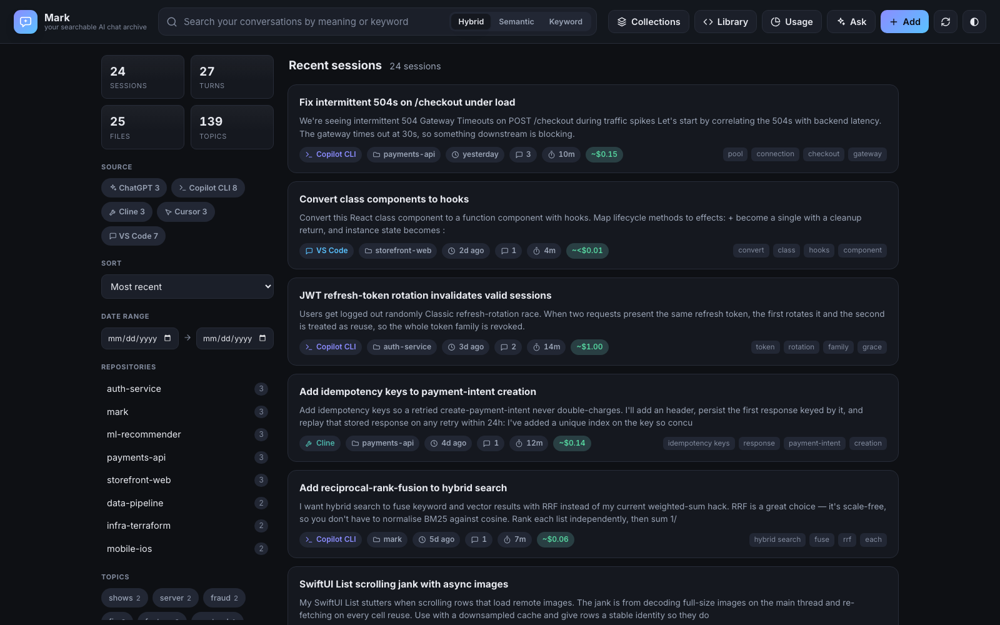
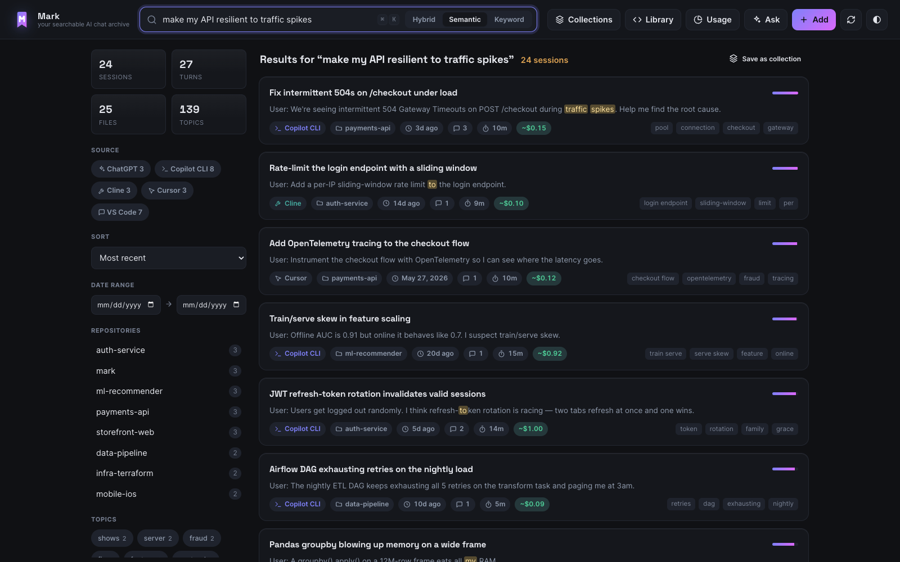
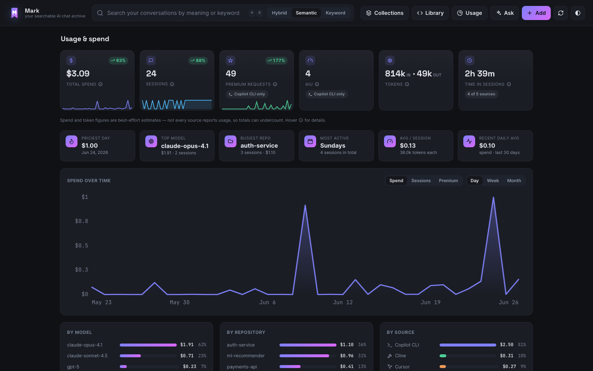
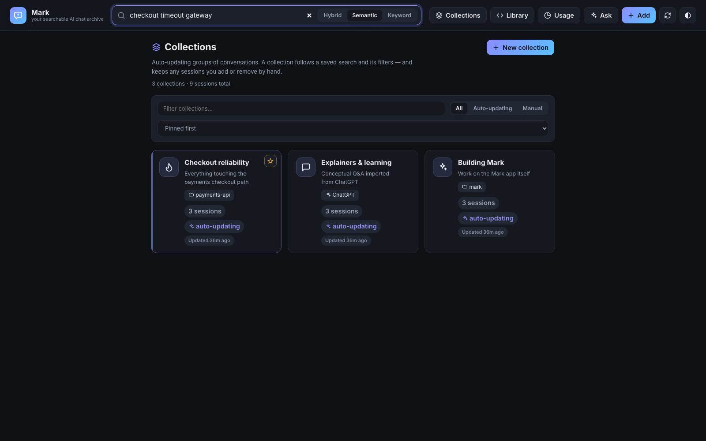
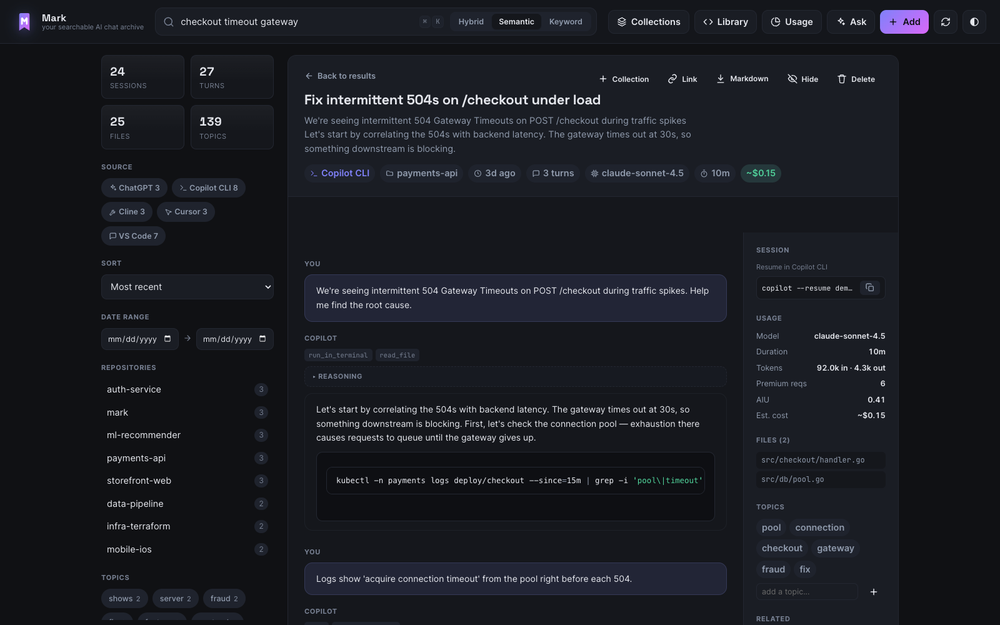
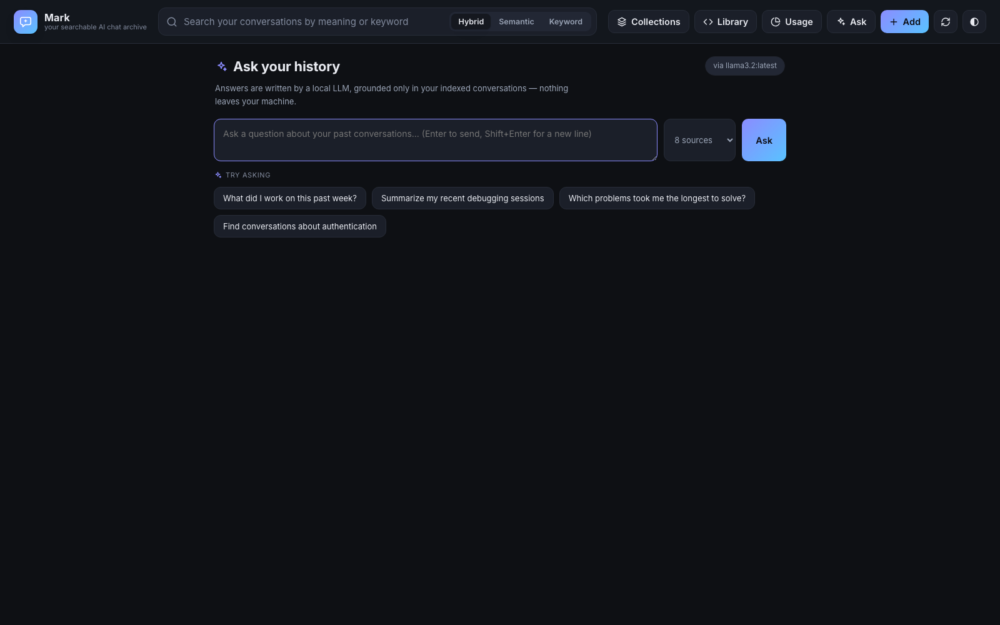

# Mark documentation

Welcome to the reference docs for **Mark**, your local, private, searchable
archive of every AI coding chat (the package is named `markive`; run it with the
`mark` command).

These pages go deeper than the [project README](../README.md). Start with
**Getting started**, then dip into whichever feature you need.

## Screenshots

|                                                                 |                                                                              |
|-----------------------------------------------------------------|------------------------------------------------------------------------------|
|      |  |
|  |              |
|   |                         |

## Contents

| Guide                                             | What it covers                                                                   |
|---------------------------------------------------|----------------------------------------------------------------------------------|
| [Getting started](getting-started.md)             | Install, first launch, where data lives, the UI at a glance                      |
| [Sources & syncing](sources.md)                   | Which chat stores Mark indexes, auto-discovery, `sources.toml`, manual re-scan   |
| [Searching & filtering](searching.md)             | Hybrid / semantic / keyword modes, the sidebar facets, sorting, related sessions |
| [Collections](collections.md)                     | Auto-updating groups, pinning/excluding, overviews, ask-a-collection             |
| [Usage & cost analytics](usage-and-cost.md)       | How spend, duration and tokens are computed; custom pricing                      |
| [Maintaining model pricing](model-pricing-maintenance.md) | Registry ownership, audits, freshness gates, and update workflow          |
| [Ask your history](ask.md)                        | Optional local-LLM Q&A over your archive via Ollama                              |
| [Snippet & command library](library.md)           | Browse every code block and shell command Mark extracted                         |
| [Managing your archive](managing-your-archive.md) | Add notes & files, import exports, hide/delete, tags, export to Markdown         |
| [MCP server](mcp.md)                              | Expose your archive to Copilot CLI, Cline, Claude Desktop and other agents       |
| [Running in Docker](docker.md)                    | The Compose setup, read-only mounts, customising per-OS                          |
| [Configuration reference](configuration.md)       | Every `MARK_*` environment variable in one table                                 |
| [FAQ & troubleshooting](faq.md)                   | Common questions, privacy, performance, fixes                                    |

## Core principles

- **100% local.** Your conversations never leave your machine. There are no API
  keys, no telemetry, and no network calls except to optional local services you
  run yourself (Ollama).
- **No config required.** With nothing set, Mark auto-discovers your chat
  histories and indexes them. Everything is opt-in from there.
- **Non-destructive.** Disabling a source or hiding a session never deletes
  indexed data — only the explicit delete/prune actions do.
