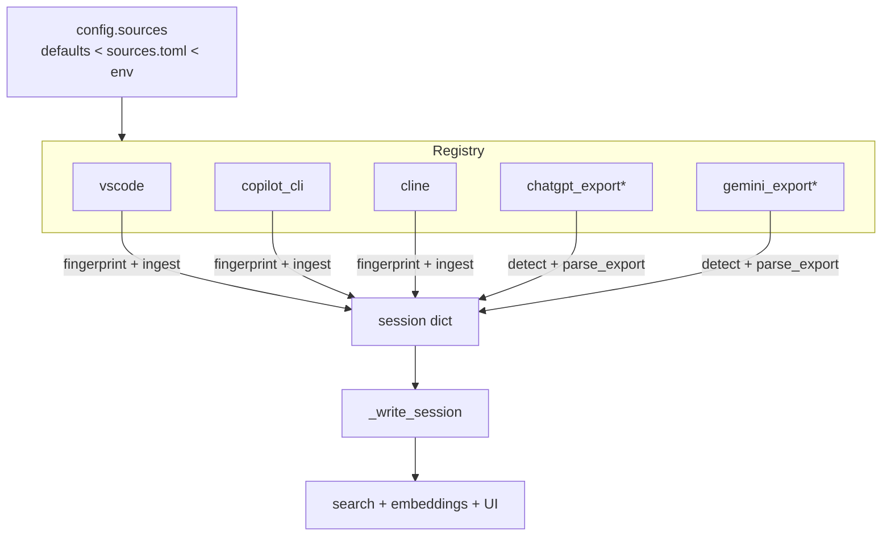

# Design: Source adapters & per-source configuration

Status: **Proposed** · Owner: graymark · Last updated: 2026-06-25

This document proposes restructuring mark's ingestion around a **source-adapter
registry** with a **declarative, per-source configuration** layer. It is the
consolidation of a design discussion and supersedes any ad-hoc notes.

---

## 1. Motivation

mark began as a Copilot-CLI indexer and grew, organically, to cover several
kinds of agent conversation:

- VS Code chat (`workspaceStorage/*/chatSessions/*.json`)
- Copilot CLI / agent store (`~/.copilot/session-store.db` + `session-state/*/events.jsonl`)
- Cline-family coding agents (Cline, Zoo Code, Roo, Kilo) under `globalStorage`

We want it to keep growing — toward **ChatGPT**, **Gemini**, **Ollama**, and
whatever comes next — without the ingest layer turning into a pile of special
cases. Three problems block that today:

1. **Monolithic ingest.** `mark/ingest.py` is ~1,300 lines mixing generic
   helpers, three source readers, persistence, embedding, and orchestration.
   Two of the three readers already share a signature; VS Code is inlined
   separately. The contract is implicit.
2. **No enable/disable.** A source can only be "turned off" by pointing its path
   at nothing. There is no `enabled = false`.
3. **Scattered, flat paths.** Each source has a bespoke `MARK_*` env override.
   Structured per-source data (a *list* of roots + a label + options) does not
   fit cleanly in flat env strings, and the known locations + the Cline-family
   name map are baked into code.

## 2. Goals / Non-goals

**Goals**

- A uniform, in-process **source-adapter contract**: adding a source is one new
  module + one registry entry.
- Support both **live local stores** (watched, auto-synced) and **cloud
  assistants exported as files** (on-demand import).
- **Declarative per-source config**: enable/disable + path overrides, with
  **zero-config defaults** so a fresh install still Just Works.
- **Behavior-preserving** refactor — identical index output for existing sources.
- Remain a **single-user, 100%-local** tool.

**Non-goals**

- An external / third-party **entry-point plugin system** (YAGNI for a local
  tool; revisit only if others want to ship adapters out-of-tree).
- Any remote/cloud sync service.
- Changing the search / embedding / UI stack.
- A schema migration of existing data (none is required — see §5).

## 3. Current state

| Concern | Today | Location |
| --- | --- | --- |
| VS Code reader | `parse_session()` + inlined loop | `mark/ingest.py` `parse_session` |
| Copilot CLI reader | `ingest_copilot_store(cur, existing, *, rebuild, progress) -> counts` | `mark/ingest.py` |
| Cline-family reader | `ingest_cline_family(cur, existing, *, rebuild, progress) -> counts` | `mark/ingest.py` |
| Persistence (shared) | `_write_session(cur, session, *, light)` | `mark/ingest.py` |
| Change detection | `sources_fingerprint()` hand-rolls each source's stat scan | `mark/ingest.py` |
| Orchestration | `ingest_all(*, rebuild, do_embed, progress)` | `mark/ingest.py` |
| Paths | per-source `MARK_*` env + platform candidates | `mark/config.py` |
| Variant→label map | `CLINE_FAMILY_SOURCES` dict in code | `mark/config.py` |
| Manual files | uploads become `source='upload'` sessions | `mark/uploads.py` |

The two `ingest_*` functions already share the signature
`(cur, existing, *, rebuild, progress) -> {added, updated, skipped}`. **The
abstraction is ~80% latent; this design formalizes it.**

The real contract everything converges on is the **session dict** consumed by
`_write_session`.

## 4. Proposed architecture

Four pillars.


<sub>* = future, demonstrates extensibility</sub>

### 4.1 Source-adapter registry (in-process)

A module-level `SOURCES` registry of adapter instances. `ingest_all` and
`sources_fingerprint` become generic loops over it. Adding a source = drop a
module in `mark/sources/` + append to the registry.

We deliberately **do not** use setuptools entry points. The registry can be
upgraded to entry-point discovery later without changing any adapter, if the
need ever arises.

### 4.2 Two adapter flavors

Sources differ in **how data arrives**, not in its shape:

- **Watched local stores** — VS Code, Copilot CLI, Cline/Roo/Zoo/Kilo, and an
  Ollama frontend that persists history. Continuously written to known
  locations; participate in fingerprint + auto-sync.
- **Cloud assistants via export files** — ChatGPT ("Export data" →
  `conversations.json`), Gemini (Google Takeout). No live store to watch; data
  arrives as a user-initiated export → modeled as **on-demand imports** that
  hang off the existing upload/import path.

```python
class WatchedSource(Protocol):          # auto-synced local stores
    key: str
    def fingerprint(self, cfg: SourceConfig) -> str: ...
    def ingest(self, cur, existing, cfg, *, rebuild, progress) -> dict[str, int]: ...

class ImportSource(Protocol):           # user-supplied export files
    key: str
    def detect(self, path: Path) -> bool: ...                 # "is this a ChatGPT export?"
    def parse_export(self, path: Path) -> Iterable[dict]: ...  # → session dicts
```

Both flavors converge on the same session dict and the same `_write_session`, so
search / metrics / UI are 100% shared; only discovery differs.

> Caveat — "Ollama" is not one format. The bare CLI/server keeps no conversation
> store; what is importable depends on the frontend (e.g. Open WebUI has a DB →
> watched source; raw `ollama run` has nothing to index). "Support Ollama" means
> "support whichever Ollama client persists history."

### 4.3 Shared session-dict contract

The single boundary between adapters and persistence. `_write_session` already
defines it; we make it explicit.

**Required:** `id`, `source`, `title`, `turns[]`, `created_at`, `updated_at`,
`content_hash`.

**Optional (coding-oriented, nullable):** `repository`, `repo_path`,
`workspace_id`, `requester`, `responder`, `source_path`, `metrics{}`,
`extra_files[]`, `attachments[]`.

A plain chat (ChatGPT/Gemini) fills the required core and leaves the coding
fields empty; token/cost fall back to the existing estimators
(`_estimate_metrics` / `_estimate_tokens`), exactly as VS Code sessions already
do. **One adapter may emit multiple `source` strings** — `cline` emits
`cline`/`zoocode`/`roo`/`kilocode`. The registry is keyed by *adapter*; each
session keeps its own `source`, so the `by_source` UI breakdown is unaffected.

### 4.4 Layered per-source configuration

A declarative config resolved with precedence **env var > user TOML file >
adapter built-in default**, so zero-config still works and the file is purely
additive.

```python
@dataclass
class SourceConfig:
    key: str                                   # "copilot_cli", "vscode", ...
    enabled: bool = True
    roots: list[Path] = field(default_factory=list)        # multi-root
    label: str | None = None
    options: dict[str, Any] = field(default_factory=dict)  # adapter-specific
```

`config.sources()` merges each adapter's defaults ← TOML ← env and returns the
effective `SourceConfig` per adapter.

Example `~/.mark/sources.toml`:

```toml
[sources.copilot_cli]
enabled = true
roots   = ["~/.copilot/session-store.db"]
options = { state_dir = "~/.copilot/session-state" }

[sources.vscode]
roots = [
  "~/Library/Application Support/Code/User/workspaceStorage",
  "~/sync/other-machine/Code/User/workspaceStorage",   # custom extra location
]

[sources.cline]
enabled = false   # turn the whole Cline family off
# extend the variant→label map without touching code:
options.extensions = { "some.new-cline-fork" = "myagent" }

[sources.chatgpt_export]   # future ImportSource
enabled = true
roots   = ["~/Downloads/chatgpt-export"]
```

TOML is chosen for comments + stdlib `tomllib` (Python 3.11+); no new
dependency. The Cline-family map (`CLINE_FAMILY_SOURCES`) folds into adapter
`options`.

## 5. Data-model impact

**None required.** The coding-specific session fields are already
optional/nullable, the `documents` table already stores attachments, and
`uploads.py` already produces `source='upload'` sessions. New sources are new
rows, not new columns.

## 6. Config resolution & compatibility

| Layer | Wins when | Purpose |
| --- | --- | --- |
| Adapter defaults | always present | zero-config; known platform locations |
| `sources.toml` | key is set | durable per-source enable/paths/options |
| `MARK_*` env | set | one-offs, CI, Docker mounts |

- **Back-compat:** existing env vars keep working by mapping onto the structure
  (`MARK_COPILOT_STORE` → `copilot_cli.roots[0]`, `MARK_VSCODE_STORAGE` →
  `vscode.roots`, `MARK_VSCODE_GLOBAL_STORAGE` → `cline.roots`, …). Deprecated
  gently; no breakage.
- **Validation:** paths are `expanduser()`-ed and resolved; missing paths are
  skipped silently (current behavior); files are scanned **read-only**; the TOML
  is data-only (no code execution). A malformed file fails safe to defaults and
  logs a warning.
- **Location:** `MARK_SOURCES_FILE` overrides, else `DATA_DIR/sources.toml`.

## 7. Confirmed behavior decisions

- **Disable is non-destructive.** A disabled source is skipped in *both*
  `sources_fingerprint()` and `ingest_all()` (no stat, no import, no sync
  trigger) but its **already-indexed rows are kept**. Removing data is a
  separate, explicit "prune disabled source" action — never a side effect of
  toggling `enabled`.
- **TOML** for the user config file (stdlib `tomllib`, comments, no new dep).

## 8. Discoverability

Add `GET /api/sources` returning each source's effective config —
`{key, label, enabled, roots, exists, indexed_count}` — to answer "why isn't X
showing up?" and to back an optional **Sources** settings panel later. Disabled
sources that still have indexed rows are shown as `disabled` with their count
and a prune affordance.

## 9. Proposed file layout

```
mark/
  sources/
    __init__.py        # SOURCES registry + iteration helpers
    base.py            # Protocols, SourceConfig, shared session-dict helpers
    vscode.py          # WatchedSource
    copilot_cli.py     # WatchedSource (emits cli)
    cline.py           # WatchedSource (emits cline/zoocode/roo/kilocode)
    chatgpt_export.py  # ImportSource   (future)
    gemini_export.py   # ImportSource   (future)
  ingest.py            # thin: orchestration loop over SOURCES
  persist.py           # write_session, _split/_clean (persistence boundary)
  config.py            # SourceConfig resolver: defaults < TOML < env
```

Generic helpers (`_compute_cost`, `_estimate_metrics`, `_uri_to_path`, token
counting, fence/URL regexes) move to `sources/base.py`. Persistence
(`write_session`, chunk splitting) and embedding (`_embed_pending`) stay central.

## 10. Migration plan (phased, each independently shippable)

1. **Extract adapters behind `WatchedSource`.** Move the three readers into
   `mark/sources/`, conform VS Code to the same method shape, make
   `ingest_all` / `sources_fingerprint` loop the registry. **Verification:**
   snapshot `/api/stats` `by_source` + total counts before and after a
   `rebuild=True`; assert identical. Pure mechanical relocation.
2. **Add `SourceConfig` + `sources.toml` + env back-compat + `/api/sources`.**
   Wire `enabled` into the fingerprint + ingest loops. Default file absent =
   today's behavior.
3. **Add the `ImportSource` flavor + first cloud importer (ChatGPT)** as the
   proof-of-extensibility, wired into the existing upload/import action.

## 11. Risks & mitigations

| Risk | Mitigation |
| --- | --- |
| Refactor regressions | Behavior-preserving extraction; before/after count + `by_source` assertion on a full rebuild |
| Config foot-guns | Zero-config default; strict validation; fail-safe to defaults on bad TOML |
| "Disabled but data still shows" confusion | `/api/sources` lists disabled sources with counts + explicit prune action |
| Multiple instances of one adapter (e.g. two Copilot stores) | `roots` is already a list; revisit instance-keying only if needed (see Open questions) |

## 12. Open questions

- Should we support **multiple named instances** of the same adapter type (e.g.
  a synced copy of another machine's `~/.copilot`)? `roots` covers most cases;
  full instance-keying is deferred.
- Should **per-source pricing** overrides live in `sources.toml` too, eventually
  folding in `MARK_PRICING_FILE`?
- Do we want a CLI (`mark sources list/enable/disable`) in addition to the API?

## 13. Decision log

- **In-process registry, not entry points** — simplicity for a local tool.
- **Two flavors over one session dict** — driven by cloud-export sources.
- **Disable keeps existing rows** — non-destructive; prune is explicit.
- **TOML for config** — comments + stdlib `tomllib`, no new dependency.
